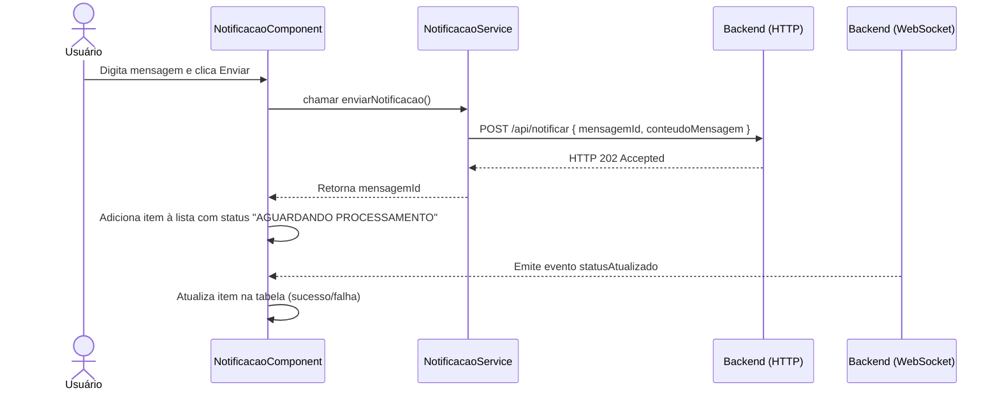

# Documentação Técnica — Acme Frontend

Este documento descreve em detalhes a implementação do **Acme Frontend**, com foco no código-fonte, responsabilidades de cada classe, serviços, interceptadores e fluxos.

---

## 📂 Estrutura Técnica

### Ponto de Entrada

- `main.ts`: inicializa a aplicação via `bootstrapApplication(App, appConfig)`.

### Configuração

- `app.config.ts`: fornece roteamento, `HttpClient` e interceptadores.

### Componente Raiz

- `app.ts`: define o componente principal (`App`), contendo `<router-outlet>`.

### Rotas

- `app.routes.ts`: define paths (`/notificacao` como principal).

### Serviço WebSocket

- `socket.service.ts`: encapsula `socket.io-client` para eventos em tempo real.
- Método `on<T>` retorna `Observable<T>`.

### Serviço de Notificação

- `notificacao.service.ts`: gera `UUID`, envia POST `/api/notificar`, retorna `mensagemId`.

### Componente de Notificação

- `notificacao.component.ts`: gerencia textarea + tabela de notificações.
- Usa `signal<ItemLista[]>` para estado reativo.
- Se inscreve em `statusAtualizado` via socket.

### Template

- `notificacao.component.html`: tabela estilizada com status e cores.

### Estilos

- `styles.css`: layout global, tabela, animações, classes de status.

### Testes

- `notificacao.component.spec.ts` cobre:
  - Envio de notificações.
  - Atualização de status via socket.
  - Mocks de `HttpClientTestingModule` e `SocketService`.

---

## 🔄 Fluxo de Dados

